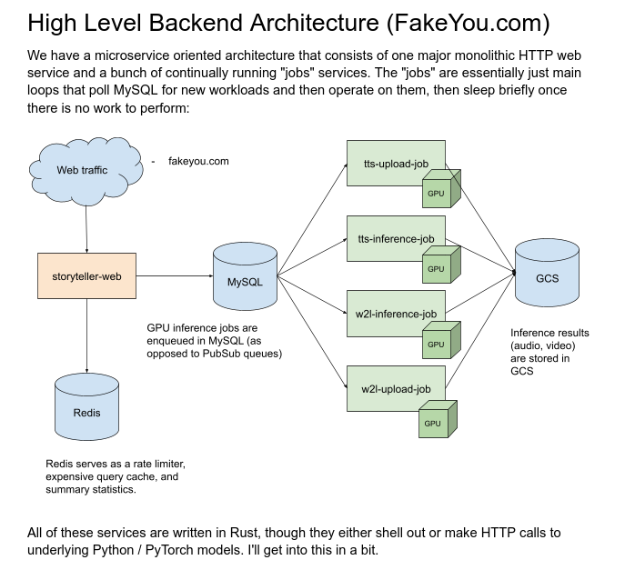
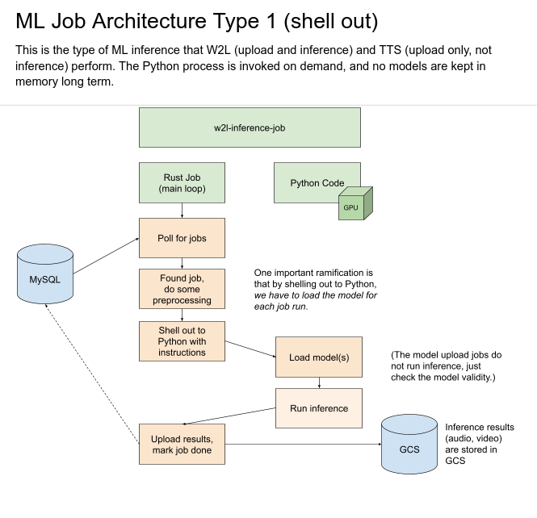
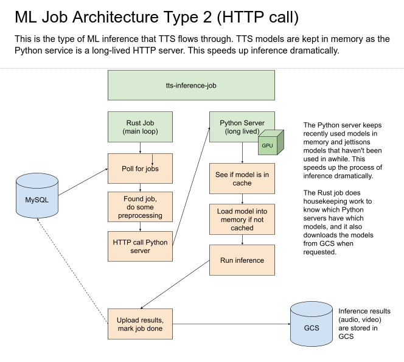

storyteller-ml
==============
The ML models that power FakeYou and other Storyteller functions.

This repository is in a bit of a rough shape, but should be improving.

TTS models (Tacotron, HifiGan, WaveGlow, etc.) live under [`tts/`, and you can find documentation there](tts/). 

We expect to add video, posture estimation, phoneme prediction, and other models soon.

FakeYou Backend Architecture
----------------------------
We have a Rust monolith that controls the user interface, account system, and all the database CRUD operations.
It doesn't do any ML work itself or have any attached GPUs.

There are a series of worker pods ("jobs") that pull from work queues and run inference, then upload the results.

The jobs are written in Rust and either shell out to Python code or call an in-container Python server that attempts 
to LRU cache models in memory.

